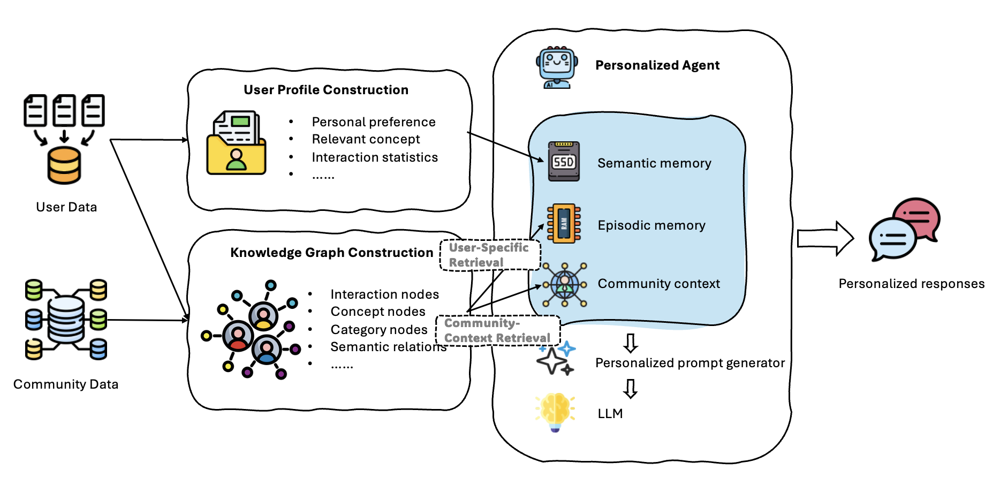
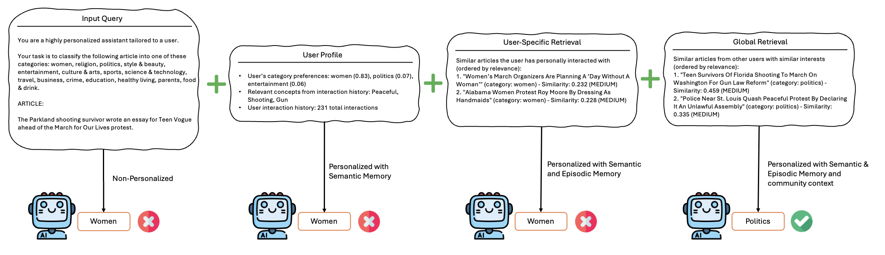
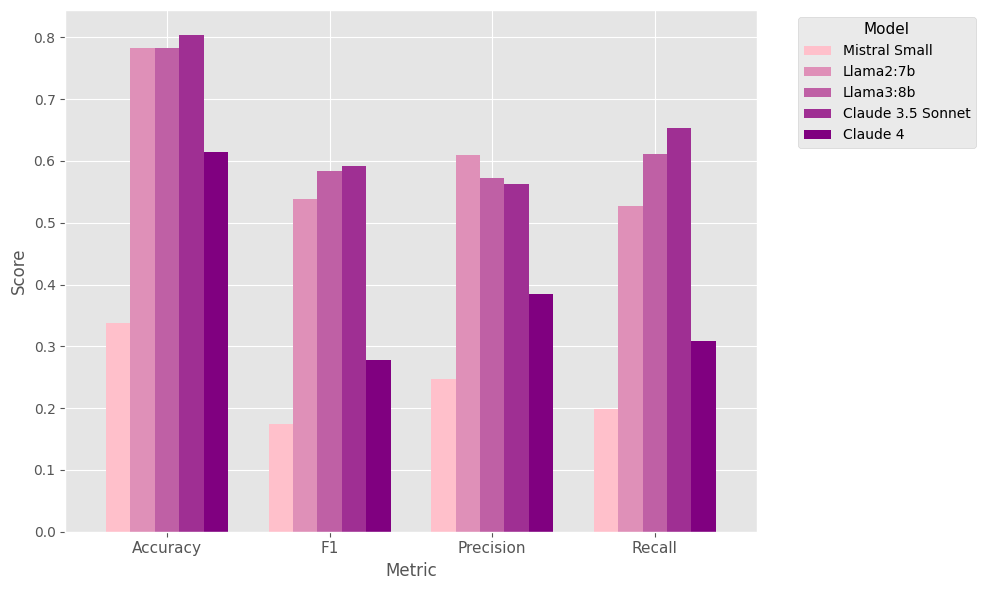

# PersonaAgent with GraphRAG: Community-Aware Knowledge Graphs for Personalized LLM

We propose a novel framework for persona-based language model system, motivated by the need for personalized AI agents that adapt to individual user preferences. In our approach, the agent embodies the user's ``persona`` (e.g. user profile or taste) and is powered by a large language model. To enable the agent to leverage rich contextual information, we introduce a Knowledge-Graph-enhanced Retrieval-Augmented Generation (Graph RAG) mechanism that constructs an LLM-derived graph index of relevant documents and summarizes communities of related information. Our framework generates personalized prompts by combining three key components: (1) a structured summary of the user’s profile, (2) semantically relevant user-specific interactions extracted from the graph, and (3) relevant global interaction patterns identified through graph-based community detection. This dynamic prompt engineering approach allows the agent to maintain consistent persona-aligned behaviors while benefiting from collective knowledge. We demonstrate the system on the LaMP benchmarks such as movie tagging, news categorization and e-commerce product rating. Figures below demonstrate the architecture of our proposed framework and an anecdote of our method.





## 📊 Benchmarks & Results

### Dataset Performance
|                                           | Metrics | Non-Personalized | ReAct | MemBank | PersonaAgent | PersonaAgent  with GraphRAG |
|:-----------------------------------------:|:-------:|:----------------:|:-----:|:-------:|:------------:|:---------------------------:|
| LaMP-2N: Personalized News Categorization |   Acc   |       0.660      | 0.639 |  0.741  |     0.796    |            0.804            |
|                                           |    F1   |       0.386      | 0.381 |  0.456  |     0.532    |            0.591            |
|    LaMP-2M: Personalized Movie Tagging    |   Acc   |       0.387      | 0.450 |  0.470  |     0.513    |            0.653            |
|                                           |    F1   |       0.302      | 0.378 |  0.391  |     0.424    |            0.662            |
|    LaMP-3: Personalized Product Rating    |   MAE   |       0.295      | 0.313 |  0.321  |     0.241    |            0.216            |
|                                           |   RMSE  |       0.590      | 0.590 |  0.582  |     0.509    |            0.484            |

### LLM Backend Comparison



## 🌟 Key Features

### 🧠 Enhanced GraphRAG Memory System
- **Dual-Source Retrieval**: Combines user's personal interactions with relevant community interactions
- **Task-Aware Content Extraction**: Automatically adapts for news articles vs movie descriptions
- **Advanced Semantic Context**: Rich personalization context with relevance scoring
- **Real-time Learning**: Continuously updates user profiles with adaptive feedback

### 🎯 Personalized Intelligence
- **Multi-Domain Support**: Pre-configured for news categorization, movie tagging and product rating
- **Community Insights**: Leverages similar users' interactions for better recommendations
- **Preference Weighting**: Balances personal preferences with global patterns
- **Context-Rich Prompts**: Enhanced prompts with both personal and community context

### 🔧 Production-Ready Architecture
- **LLM Integration**: Native support for Ollama, OpenAI, HuggingFace, and custom APIs
- **Configurable Datasets**: Easy configuration for different domains and tasks
- **Scalable Processing**: Efficient batch processing with GraphRAG optimization
- **Comprehensive Evaluation**: Detailed performance analysis and metrics

## 🏗️ System Architecture

```
PersonaAgent System
├── Core Components
│   ├── GraphRAGMemory
│   │   ├── Dual Retrieval System (User + Global)
│   │   ├── Task-Aware Content Extraction
│   │   ├── Advanced Semantic Context
│   │   └── Community-Based Insights
│   ├── LLMPersonaAgent (Base)
│   └── OllamaPersonaAgent (Production)
├── LLM Integration
│   ├── OllamaPersonaAgent (Local Models)
│   ├── OpenAI Integration (GPT Models)
│   ├── HuggingFace Integration (Open Source)
│   └── Generic API Support (Custom Endpoints)
├── Dataset Configuration
│   ├── News Articles (Category Classification)
│   ├── Movie Descriptions (Tag Classification)
│   ├── Custom Dataset Support
│   └── Data Processing Tools
└── Demo & Evaluation
    ├── Configurable Demo System
    ├── Performance Benchmarking
    ├── Top User Extraction Tools
    └── Comprehensive Analytics
```

## 📋 Requirements

```txt
Python 3.8+
numpy>=1.21.0
scikit-learn>=1.0.0
networkx>=2.6.0
requests>=2.25.0
ollama (optional, for local LLM)
openai (optional, for GPT models)
transformers (optional, for HuggingFace)
torch (optional, for local models)
```

## 🚀 Quick Start

### Dataset
We use publicly available data from the [LaMP](https://arxiv.org/abs/2304.11406) benchmark. We followed the data processing steps in [Democratizing Large Language Models via Personalized Parameter-Efficient Fine-tuning](https://arxiv.org/abs/2402.04401) and the  processed data can be downloaded [here](https://drive.google.com/file/d/1bJ3Rh_sqrw3suwwweFbra5CTV7GVjgxF/view?usp=sharing), unzip it, and place it under the ./data folder

### Installation

```bash
# Clone the repository
git clone <repository-url>
cd PersonaAgent

# Install dependencies
pip install -r requirements.txt

# Optional: Install Ollama for local LLM support
# Visit https://ollama.ai/ for installation instructions
```

### Quick Demo

```bash
# Run demo with news dataset and Ollama
cd src
python news_categorization_demo.py --dataset news --model llama3 --sample-size 10

# List available datasets
python news_categorization_demo.py --list-datasets
```

### Production Usage

```python
from src.llm_integration import AdaptiveOllamaPersonaAgent

# Initialize with task-specific configuration
agent = AdaptiveOllamaPersonaAgent(
    categories=["entertainment", "sports", "politics", "technology"],
    model_name="llama3",
    ollama_host="http://localhost:11434",
    task_type="news", 
    persona_weight=0.4
)

# Add user interactions
user_interactions = [
    {"text": "Concert review", "title": "Music News", "category": "entertainment"},
    {"text": "Game highlights", "title": "Sports Update", "category": "sports"}
]
agent.add_user_interactions("user123", user_interactions)

# Make personalized predictions
query = "Which category does this article relate to? Article: New smartphone features unveiled."
prediction, metadata = agent.predict("user123", query)

print(f"Prediction: {prediction}")
print(f"User interactions: {metadata['semantic_context']['user_interactions']}")
print(f"Global insights: {metadata['semantic_context']['global_interactions']}")
```

## 🎯 Enhanced Personalization Features

### Dual-Source Retrieval
```python
# Enhanced retrieval provides both sources
semantic_context = {
    "user_interactions": [  # User's personal history
        {"title": "Music Review", "category": "entertainment", "relevance_score": 0.85}
    ],
    "global_interactions": [  # Similar users' interactions
        {"title": "Concert News", "category": "entertainment", "relevance_score": 0.73}
    ],
    "category_preferences": {"entertainment": 0.67, "sports": 0.21},
    "relevant_concepts": ["music", "concert", "album"],
    "interaction_count": 145
}
```

### Enhanced Prompts
```
Task: Classify the following article into categories: [politics, entertainment, sports]

Article: Tech company announces AI breakthrough in healthcare

PERSONALIZATION CONTEXT:

Similar articles the user has personally interacted with:
- "Medical AI Research" (Category: science & technology, Relevance: 0.856)

Similar articles from other users with similar interests:
- "Healthcare Innovation" (Category: science & technology, Relevance: 0.743)

User's category preferences: science & technology (0.45), business (0.32), politics (0.23)

Relevant concepts from interaction history: AI, healthcare, technology, innovation

User interaction history: 67 total interactions

Based on the article content and user's personal interactions, similar interactions 
from other users, and relevant concepts as references.

Answer with just the category name.
```


## 🔧 Configuration System

### Dataset Configuration
```python
# Built-in datasets
datasets = {
    "news": "News Articles (15 categories)",
}

# Custom dataset configuration
custom_config = {
    "name": "Custom Dataset",
    "categories": ["cat1", "cat2", "cat3"],
    "data_files": {
        "train": "custom_train.json",
        "labels": "custom_labels.json"
    },
    "task_type": "custom"
}
```

### LLM Backend Configuration
```python
# Ollama (Local)
agent = OllamaPersonaAgent(
    categories=categories,
    model_name="llama3",  # or mistral, codellama
    ollama_host="http://localhost:11434"
)

# OpenAI
agent = OpenAIPersonaAgent(
    categories=categories,
    model_name="gpt-3.5-turbo",
    api_key="your-openai-key"
)

# HuggingFace (Local)
agent = HuggingFacePersonaAgent(
    categories=categories,
    model_name="microsoft/DialoGPT-medium",
    device="cuda"  # or "cpu"
)
```

## 📈 Performance & Evaluation

### Comprehensive Metrics
```python
# Run evaluation
evaluation = agent.evaluate(predictions, labels)

# Results include:
{
    "accuracy": 0.8543,
    "total_examples": 1000,
    "correct_predictions": 854,
    "category_stats": {
        "entertainment": {"precision": 0.92, "recall": 0.88, "support": 150},
        "politics": {"precision": 0.85, "recall": 0.91, "support": 200}
    }
}
```

### Demo Results Example
```
🎯 Prediction Demonstrations:

Example 1:
User ID: 11762
Query: Which category does this article relate to among the following categories?...
Prediction: entertainment ✓
True label: entertainment
Top preferences: entertainment (0.73), sports (0.13), travel (0.07)

📈 Running Evaluation:
Accuracy: 0.8750
Correct: 7/8

Top Category Performance:
  entertainment: P=0.900, R=0.850, Support=4
  politics: P=0.800, R=0.900, Support=4
```

## 🛠️ Advanced Usage

### Custom Dataset Creation
```python
from src.dataset_config import DatasetConfig

config = DatasetConfig(
    name="Custom News",
    categories=["tech", "politics", "sports"],
    data_files={
        "train": "data/custom_train.json",
        "labels": "data/custom_labels.json"
    },
    id_field="user_id",
    profile_field="history",
    text_field="content"
)

# Use with configurable demo
python configurable_demo.py --config-file custom_config.json
```

### Batch Processing
```python
# Process large datasets efficiently
predictions = agent.batch_predict(large_dataset)

# With progress tracking
for i, example in enumerate(dataset):
    prediction, metadata = agent.predict(example['id'], example['input'])
    if i % 100 == 0:
        print(f"Processed {i} examples")
```


## 🔬 Research & Development

### Current Capabilities
- ✅ GraphRAG with dual-source retrieval
- ✅ Task-aware content extraction and processing
- ✅ Real LLM integration (Ollama, OpenAI, HuggingFace)
- ✅ Configurable multi-domain support
- ✅ Community-based personalization insights
- ✅ Adaptive learning with user feedback
- ✅ Comprehensive evaluation framework

### Future Enhancements
- 🔄 **Advanced Embeddings**: Sentence-BERT and domain-specific embeddings
- 🔄 **Federated Learning**: Privacy-preserving multi-user learning
- 🔄 **Real-time Adaptation**: Streaming updates and online learning
- 🔄 **Multi-modal Support**: Image, video, and audio content integration
- 🔄 **Explainable AI**: Interpretable personalization decisions


## 🤝 Contributing

1. Fork the repository
2. Create a feature branch (`git checkout -b feature/enhancement`)
3. Make your changes with comprehensive tests
4. Update documentation as needed
5. Submit a pull request with detailed description

### Development Guidelines
- Follow PEP 8 style guidelines
- Add comprehensive docstrings
- Include unit tests for new features
- Update README and documentation
- Test with multiple LLM backends

## 📄 License

This project is licensed under the MIT License - see the LICENSE file for details.

## 📚 References & Citations

- [LaMP: When Large Language Models Meet Personalization](https://arxiv.org/abs/2304.11406)
- [Retrieval-Augmented Generation for Knowledge-Intensive NLP Tasks](https://arxiv.org/abs/2005.11401)
- [Graph Neural Networks: A Review of Methods and Applications](https://arxiv.org/abs/1812.08434)
- [PersonaAgent: When Large Language Model Agents Meet Personalization at Test Time](https://arxiv.org/pdf/2506.06254)
- [Democratizing Large Language Models via Personalized Parameter-Efficient Fine-tuning](https://arxiv.org/abs/2402.04401)

## 📞 Contact & Support

- **Issues**: Open an issue on GitHub for bugs or feature requests
- **Discussions**: Use GitHub Discussions for questions and ideas

---

**PersonaAgent with GraphRAG** - Advanced personalized content classification through enhanced GraphRAG memory systems, dual-source retrieval, and community insights. Perfect for news categorization, movie recommendations, and custom domain applications.

*Built with ❤️ for the AI research community*
